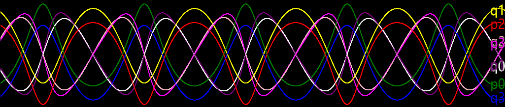
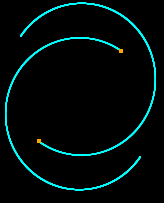
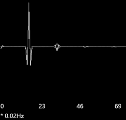
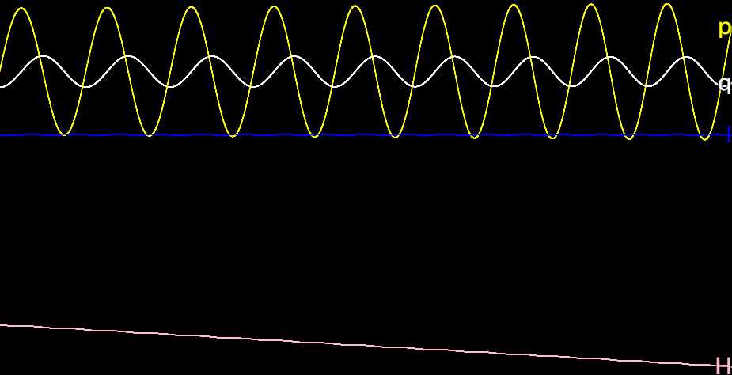
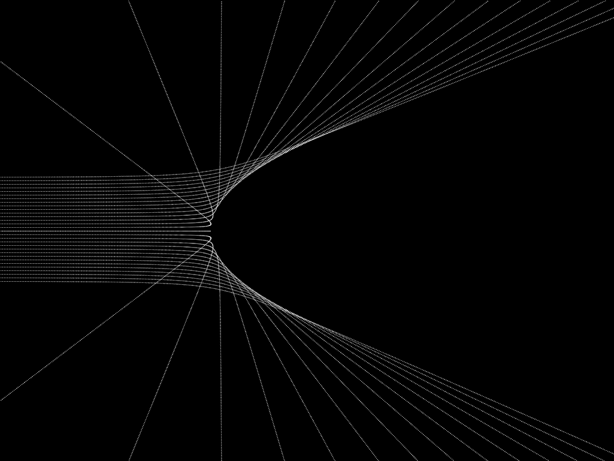
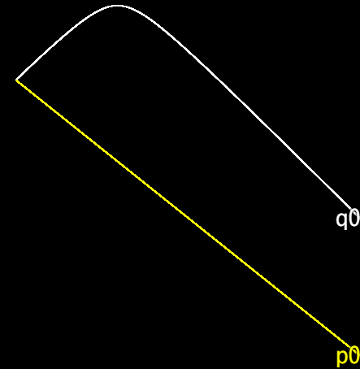

## Kepler’s 2-body problem

```js
// There are 8 curves to be drawn on the canvas
canvas.n = 8;
// Setting the hamiltonian of the system
rungeKutta.func = canonicalEquation(4, (t, qp) => {
  let [x1, y1, x2, y2, px1, py1, px2, py2] = qp;
  return px1**2 + py1**2 + px2**2 + py2**2 - 500 / hypot(x1-x2, y1-y2);
});
// Setting the initial conditions of the system
rungeKutta.initial = [-3, -3, 3, 3, 2, -3, -2, 3];
// Setting the scale of the graph
canvas.mappingY = y => 20 * y + Graphics.height/2;
// Setting the colors for graphing; there are 8 curves and thus 8 colors
canvas.colors = ["white", "yellow", "pink", "blue",
                 "green", "purple", "red", "magenta"];

// Following codes creates the sprites and bitmaps for visualization
// (Using API provided by rpg_core.js, see [1] for help)
var traceSprite = new Sprite();
var star1 = new Sprite();
var star2 = new Sprite();
scene.addChild(traceSprite);
scene.addChild(star1);
scene.addChild(star2);
traceSprite.bitmap = new Bitmap(Graphics.width, Graphics.height);
star1.bitmap = star2.bitmap = new Bitmap(4, 4);
star1.bitmap.fillAll('orange');
star1.anchor.x = star1.anchor.y = 0.5;
star2.anchor.x = star2.anchor.y = 0.5;

// Updating the state of the sprites when a new sample comes out
canvas.onTrace = (t, qp) => {
  // Setting the position of sprites of stars
  [star1.x, star1.y, star2.x, star2.y] =
      qp.slice(0, 4).map(canvas.mappingY);
  // Plotting the trajectory
  traceSprite.bitmap.setPixel(star1.x, star1.y, 'cyan');
  traceSprite.bitmap.setPixel(star2.x, star2.y, 'cyan');
  return true;
};

// Restarting to apply the changes
restart();
```




## Adiabatic invariants

```js
// The altering parameter omega mentioned above; it should change slowly
var omega = t => 4 + 0.05 * t;
// The hamiltonian of the system
var hamiltonian = (t, qp) => qp[1]**2/2 + omega(t)**2 * qp[0]**2/2;
// Setting the hamiltonian of the system
rungeKutta.func = canonicalEquation(1, hamiltonian);
// There are 8 curves to be drawn on the canvas
canvas.n = 4;
// The labels of the curves will be q, p, H, I
canvas.getLabelString = i => 'qpHI'[i];
// The colors for the curves
canvas.colors = ["white", "yellow", "pink", "blue"];
// Tracing the H and I data when a new sample comes out
canvas.trace = function (t, data) {
  // Calculating the hamiltonian at this time
  let h = hamiltonian(t, data);
  // To be drawn on the graph at this time: [q, p, h, h/omega]
  data = data.concat([h, h / omega(t)]);
  // Calling old method, a JavaScript trick
  return this.__proto__.trace.call(this, t, data);
};
// Restarting to apply the changes
restart();
```



## Scattered beam of particles

```js
// The total number of particles in the beam
var n = 30;
// The array of the n ODE solvers
rungeKuttas = [];
for (let i = 0; i < n; i++) {
  // Create an ODE solver
  rungeKuttas[i] = RungeKutta.solveHamiltonian(
    // Parameters list:
    2,                           // DOF
    [-20, (i - n/2)*0.3, 4, 0],  // Initial conditions
    Number.POSITIVE_INFINITY,    // Maximum time
    null,                        // Canvas; null for no canvas
    (t, qp) => {                 // The hamiltonian
      let [x, y, px, py] = qp;
      return px**2 + py**2 + 30/hypot(x,y);
    }
  );
}

// Create the sprite and bitmap for visualization (rpg_core.js API)
var traceSprite = new Sprite();
scene.addChild(traceSprite);
traceSprite.bitmap = new Bitmap(Graphics.width, Graphics.height);

// The scale to be used for graphing
var my = y => 20 * y + Graphics.height/2;
// This is the function to be called at each frame refreshing
update = function () {
  for (let i = 0; i < n; i++) {
    // Calculate the coordinates of the point to be plotted
    let xy = [0, 1].map(j => my(rungeKuttas[i].current[j]))
    // Plotting the trajectory
    traceSprite.bitmap.setPixel(...xy, 'white');
    // Incrementing ODE solvers
    rungeKuttas[i].update();
  }
};

// Restarting to apply the changes
restart();
// Hiding the original canvas
canvas.visible = false;
```



## Special relativity

```js
rungeKutta.func = canonicalEquation(1, (t, qp) => sqrt(qp[1]**2 + 10) - 0.8*qp[0])
rungeKutta.initial = [-10, -10]
canvas.mappingX = t => 10*t
restart()
```


